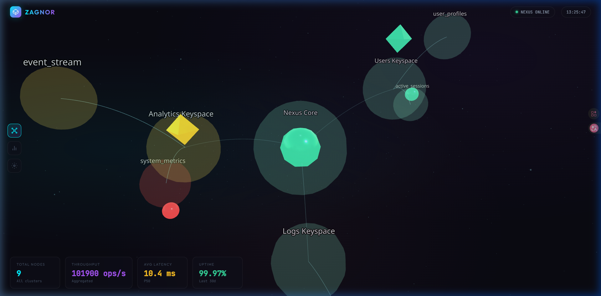
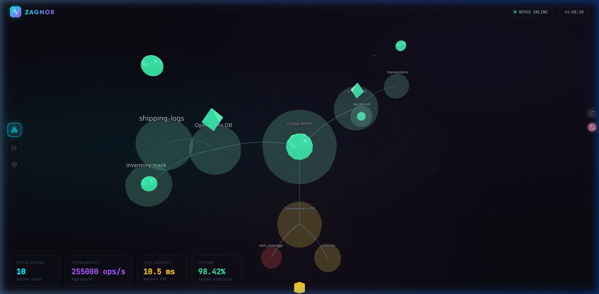
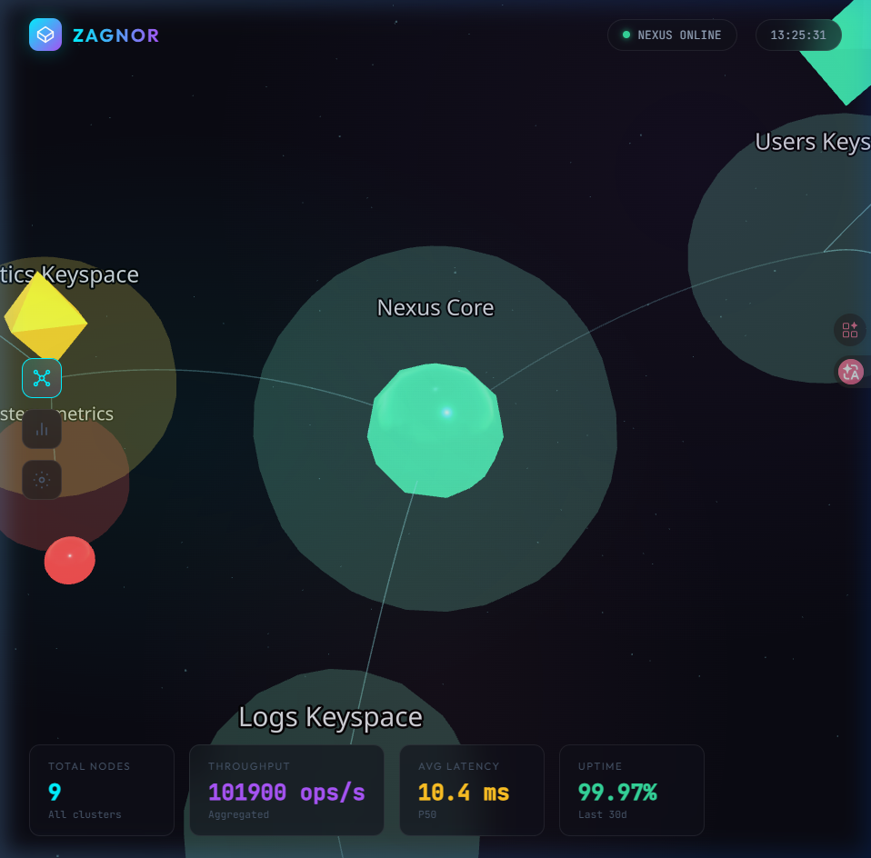

# Zagnor Nexus

**Zagnor Nexus** is an immersive **3D Data Visualization Command Center**. It transforms traditional flat dashboards into a dynamic, intergalactic 3D environment, specifically designed to visualize Big Data architectures like Cassandra clusters. Built with React, Three.js (React Three Fiber), and a sleek Glassmorphism design system.

---

## Sneak Peek

### Nexus Core & Topology


### Enterprise Mesh Configuration


### Glowing Keyspaces & Interactive Metrics


---

## Features

*   **3D WebGL Topology**: Visualize your clusters, keyspaces, and tables as interactive geometric nodes floating in space.
*   **Status-Based Visuals**: Immediate visual feedback on node health (Healthy/Warning/Critical) through color-coded neon glowing effects.
*   **Immersive Interactivity**: Hover and click on nodes to reveal deep metric details (Latency, Throughput, Storage, Replicas).
*   **Ambient VFX**: Features a floating particle field, curved neon connection lines, pulsing opacities, and a starry backdrop.
*   **Glassmorphism HUD**: A high-end overlay containing live-updating statistics, real-time clocks, and navigation controls.
*   **Auto-Rotating Orbit Controls**: Smooth camera panning, zooming, and automated rotation.

---

## Tech Stack

*   **Frontend**: React (with TypeScript)
*   **Build Tool**: Vite
*   **3D Engine**: Three.js integrated via `@react-three/fiber`
*   **3D Helpers**: `@react-three/drei` (OrbitControls, Text, Stars, Billboard)
*   **Styling**: Vanilla CSS (CSS Variables, Glassmorphism)

---

## Quick Start

### 1. Clone the repository
```bash
git clone https://github.com/achrafS133/zagnor.git
cd zagnor
```

### 2. Install dependencies
```bash
npm install
```

### 3. Start the development server
```bash
npm run dev
```

Your command center will be online at [http://localhost:5173/](http://localhost:5173/).

---

## Project Architecture

```text
zagnor/
├── public/                 # Static assets and screenshots
├── src/
│   ├── components/
│   │   ├── NexusScene.tsx      # Main 3D Canvas
│   │   ├── DataNodeMesh.tsx    # Interactive node with glowing effects
│   │   ├── ConnectionLines.tsx # Curved neon data links
│   │   ├── ParticleField.tsx   # Ambient space particles
│   │   └── HUD.tsx             # Overlay UI (Metrics, Details panel)
│   ├── data/
│   │   └── mockData.ts         # Mock Cassandra cluster metrics
│   ├── App.tsx                 # Root application
│   └── index.css               # Global Design System & Variables
└── .agents/workflows/
    └── zagnor-dev.md           # Development workflows
```

---

## Future Roadmap

*   **Backend Integration**: Connect a Laravel API to fetch live metrics directly from a Cassandra cluster.
*   **Real-Time Data Streams**: Utilize WebSockets to push live ops/s and latency changes to the UI.
*   **WebXR Support**: Full VR immersion with WebXR allowing users to step inside the data.
*   **Query Interface**: Execute CQL queries straight from the 3D HUD.

---

**Developed with love using React & Three.js**
